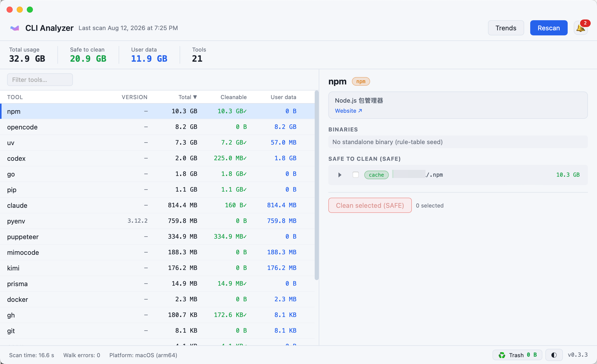
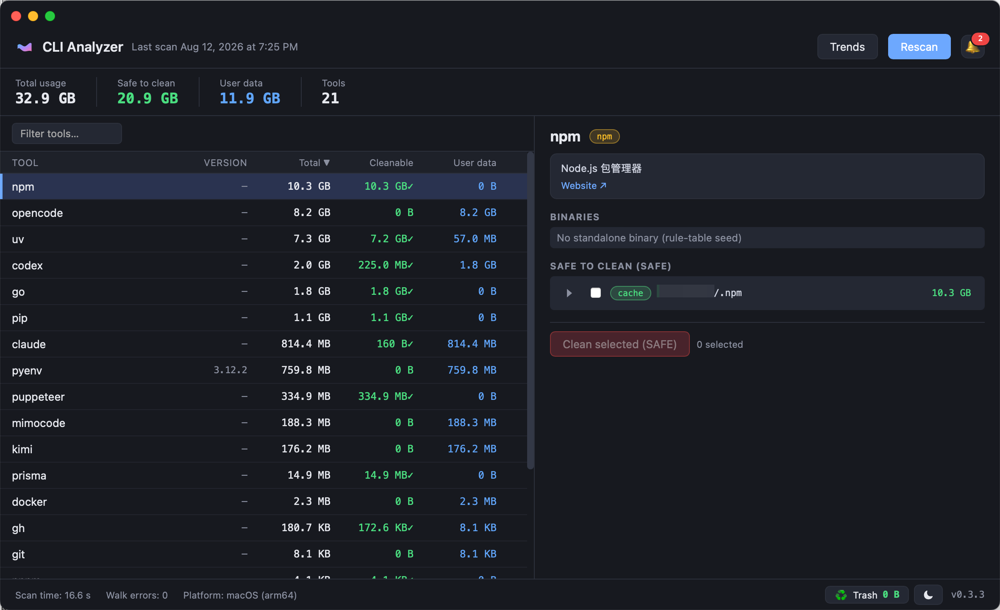

<h1 align="center">CLI Analyzer</h1>

<p align="center">
  Find out which CLI tools are eating your disk — and reclaim the space <b>safely</b>.
</p>

<p align="center">
  
  
  
  
</p>

<p align="center">
  <b>English</b> · <a href="README.zh-CN.md">简体中文</a>
</p>

---

Cleanup tools like CleanMyMac show how much disk your **desktop apps** use — but they are blind to **CLI tools**. A CLI tool's footprint is scattered across hidden dotfiles and XDG directories (`~/.claude`, `~/.npm`, `~/.cache/*`), so it gets lumped under "Other" or ignored entirely.

CLI Analyzer scans every CLI tool installed on your machine, attributes its **total** disk footprint (executable + package dirs + data/cache dirs), and identifies space that is **safe to clean**. One binary, two interfaces: a terminal CLI and a native dark-mode GUI (Wails v2).

| Light theme | Dark theme |
|---|---|
|  |  |

## Features

- **Detection** — enumerates `$PATH` executables, resolves symlinks, and classifies each by install source (versioned installer / brew formula / npm package / pipx / pyenv shim / go / cargo / other). The Node.js runtime family (node / npm / npx / corepack / node-gyp) is merged into one `nodejs` entry instead of showing every command in the same install dir as a separate tool (common on Windows)
- **Attribution** — total footprint = executable + package dir (`Cellar`, `node_modules`, `versions/…`) + platform data dirs (`~/.cache/<name>`, `~/.config/<name>`, `~/.local/share/<name>`, macOS `~/Library/*`, Windows `%APPDATA%`…)
- **Two-level safety model**
  - **SAFE** (caches, old versions, backups, package-manager caches) — moved into the built-in trash (recoverable) after per-item confirmation
  - **USER** (config, history, venv) — display-only, **never auto-deleted**. The hard gate lives in the cleaner layer; `--yes` cannot bypass it
- **Built-in trash** — deletions go to the app's own trash first (same filesystem, instant), recoverable for 7 days (configurable in Preferences); expired items move to the OS trash or are deleted permanently
- **Restore** — restore a trashed item from the GUI trash panel or `cli-analyzer trash restore`; `clean --permanent` skips the built-in trash entirely
- **Usage trends** — every scan appends a snapshot; view total/cleanable over time (SVG chart) and the top cleanable growers, with a bell reminder when a tool's cleanable space exceeds a configurable limit (click it to list the tools and jump to one)
- **Tree drill-down** — expand a cleanable item to its one-level child dirs (`~/.npm` → `_cacache` 10G / `_npx` 764M) and clean only the selected children. Sub-path deletion passes the same SAFE gate + guard (must be a child of an already-scanned, attributed parent)
- **Built-in updater** — checks GitHub Releases on startup for a new version (toggleable in Preferences, with a 24h rate-limit cache); prompts to download with a progress bar, verifies the SHA256 checksum, then opens the installer for you to complete manually. CLI: `cli-analyzer update check`. Note: within 24h of a release, a cached check may not yet report it — the prompt appears once the cache refreshes
- **Official uninstall** — don't know the uninstall command? The tool detects the install source (brew / npm / pipx / cargo…), shows the standard command and can run it for you, then detects leftover config/cache dirs and moves them into the built-in trash (recoverable) — the only operation allowed to touch USER data, never deleting it permanently. System-critical tools are blocked. CLI: `cli-analyzer uninstall <tool>`
- **Localized UI** — Simplified Chinese / Traditional Chinese / English; follows the system language by default, switchable in Preferences → Language (applies instantly; macOS native menu applies after restart)
- **Two interfaces** — CLI (`scan` / `clean` / `cache` / `trash` / `trends` / `update` / `version`) + native GUI
- **Unattributed data dirs** — top-level dirs under the data roots that no tool claims (leftovers of removed or never-on-PATH tools) appear in a collapsible "Unattributed data" section; USER-level, move-to-trash only (recoverable), filtered by the non-CLI exclusion system (GUI apps, their data and command-line companions are out of scope)
- **Health probing** — tools with an unknown version are probed in the background (`--version` / `-V` / `--help`, 3s timeout, result cache keyed by binary path/size/mtime, GBK-safe on Windows); failures degrade silently to `—`

## Installation

> **Releases**: installers for macOS / Windows / Linux are published on the [Releases page](https://github.com/kevinjoy89/cli-analyzer/releases). Building from source also works.
>
> **Updates**: starting from the release that ships this feature, the app checks for new versions automatically on startup (disable in Preferences → Update) and prompts you to download when one is available. Downloads land in `~/Downloads` and are verified against the published SHA256 checksums before the installer is opened — installation itself stays with the system flow. macOS builds are currently **unsigned**, so Gatekeeper may require right-click → Open on first launch of a downloaded copy.

Requirements: **Go ≥ 1.26** and **npm**.

```bash
brew install go
export PATH="/opt/homebrew/opt/go/bin:$HOME/go/bin:$PATH"
go install github.com/wailsapp/wails/v2/cmd/wails@v2.13.0

# CLI only
go build -o bin/cli-analyzer .

# GUI app (the same binary also works as a CLI)
wails build        # → build/bin/cli-analyzer
```

Cross-platform installers (macOS dmg / Windows installer / Linux deb + AppImage) are covered in [docs/packaging.md](docs/packaging.md); one-shot macOS packaging via `./scripts/build-dmg.sh`.

> **Mirror note**: This project does **not** depend on any specific Go mirror — the default proxy works everywhere, no config needed. Users on mainland-China networks who hit download timeouts can run once:
> `go env -w GOPROXY=https://goproxy.cn,direct`
> That setting lives in your own environment (`~/.config/go/env`), is not committed, and does not affect other developers; restore with `go env -u GOPROXY`.

## Usage

```bash
cli-analyzer scan                    # scan (first run is slower, cached afterwards)
cli-analyzer scan --refresh --json   # force a rescan, JSON output (includes unattributed + probed versions)
cli-analyzer clean                   # interactive, per-item SAFE cleanup (into built-in trash)
cli-analyzer clean --dry-run --all   # show the plan only, delete nothing
cli-analyzer clean --yes kimi        # clean all SAFE items for a specific tool
cli-analyzer clean --permanent       # delete immediately, skip the built-in trash
cli-analyzer trash list              # list built-in trash items
cli-analyzer trash restore <id>      # restore an item to its original path
cli-analyzer trash empty             # empty the built-in trash (permanent)
cli-analyzer trends [days]           # usage trends over the last N days (default 30)
cli-analyzer update check           # check for a new version (exit: 0 up-to-date / 2 update / 1 error)
cli-analyzer uninstall <tool>       # standard uninstall + residue cleanup (via built-in trash)
cli-analyzer version                # show version and install source (e.g. 0.3.3 (darwin, dmg))
cli-analyzer cache --clear           # clear the scan cache
cli-analyzer                         # open the GUI
```

Example scan output:

```
Tool   Cmd   Total   Cleanable(SAFE)   User   Source
nodejs 5     10.5 GB  10.5 GB          89.7 MB nodejs
opencode -   8.2 GB   0 B              8.2 GB  other
uv     -     7.3 GB   7.2 GB           57.0 MB other
codex  -     2.0 GB   288.7 MB         1.8 GB  other
pip    -     1.1 GB   1.1 GB           0 B     pip
go     -     1.0 GB   753.7 MB         282.3 MB go
pyenv  -     759.8 MB 0 B              759.8 MB pyenv
...
Total  -     31.5 GB  19.9 GB          11.7 GB -
```

(The Node.js runtime family — node / npm / npx / corepack / node-gyp — is merged into a single `nodejs` entry; its detail panel lists every bundled command and binary path, and the `~/.npm` cache stays SAFE-cleanable.)

**Safety model**: only SAFE-level items (caches / old versions / backups / package-manager caches) are cleaned; USER-level (config / history / venv) is display-only. Old-version cleanup always keeps the current version (e.g. the symlink target for `claude`).

**Deferred deletion**: SAFE items are moved into the app's built-in trash first — same filesystem, instant, and recoverable. They stay there for the retention window (default 7 days, configurable in Preferences) and are then purged: by default into the OS trash, or permanently if configured. The GUI status bar shows the trash occupancy and the earliest expiry, so "cleaned" and "space released" stay distinct. Use `clean --permanent` to bypass the built-in trash.

### Cleaning boundaries — verified, never listed as SAFE

| Path | Why it must not be auto-deleted |
|---|---|
| `~/.cache/opencode`, `~/.cache/mimocode` | named "cache" but are actually **plugin install dirs** of opencode-family tools (MCP servers, language servers, skills, `package.json` manifests) |
| pyenv / rustup old toolchains (non-current) | pip-installed commands hardcode the interpreter path in their shebang (e.g. 16 commands → `~/.pyenv/versions/3.6.15/bin/python3.6`); projects may pin a toolchain via `rust-toolchain.toml` |
| brew non-current Cellar versions | may be depended on by other formulae (e.g. fontconfig); `brew cleanup` handles them safely |
| `~/.cache/codex-runtimes/codex-primary-runtime` | the runtime codex is actively using; only `codex-runtime-install-*` staging dirs are cleanable |

## Cross-platform

- The scan core is pure Go stdlib — `GOOS=linux/windows go build ./...` cross-compiles directly
- **macOS**: additionally scans `~/Library/{Caches, Application Support, Preferences}`
- **Linux**: XDG dirs; GUI build needs `libwebkit2gtk-4.1`, `libgtk-3`
- **Windows**: `%APPDATA%` / `%LOCALAPPDATA%`; GUI requires building on a Windows host (WebView2)

## Known limitations (v1)

- Hard-linked files are counted once per path (sizes slightly inflated); future: inode-based dedup
- Scan results are a snapshot; run `--refresh` (or hit "Rescan" in the GUI) after files change

## Project layout

```
main.go             # argv dispatch: scan/clean/cache/trash/trends/version → CLI; otherwise Wails GUI
gui/service.go      # Wails bindings (the only file importing wails)
internal/scanner/   # discover → classify → attribute → cleanability (pure core)
internal/rules/     # two-level rules table + generic parser
internal/platform/  # per-OS data roots & executable detection (build tags)
internal/disk/      # parallel directory size measurement (no du dependency)
internal/cleaner/   # SAFE hard gate + guard + deferred deletion
internal/trash/     # built-in trash: defer/restore/sweep + per-OS system trash
internal/config/    # local config (retention, expire action, reminder threshold)
internal/history/   # scan snapshots in SQLite for usage trends
internal/cli/       # scan / clean / cache / trash / trends subcommands
```

## Contributing

Bug reports and feature ideas are welcome — open an [issue](https://github.com/kevinjoy89/cli-analyzer/issues). Pull requests are appreciated.

## License

[MIT](LICENSE) © 2026 kevinjoy89
