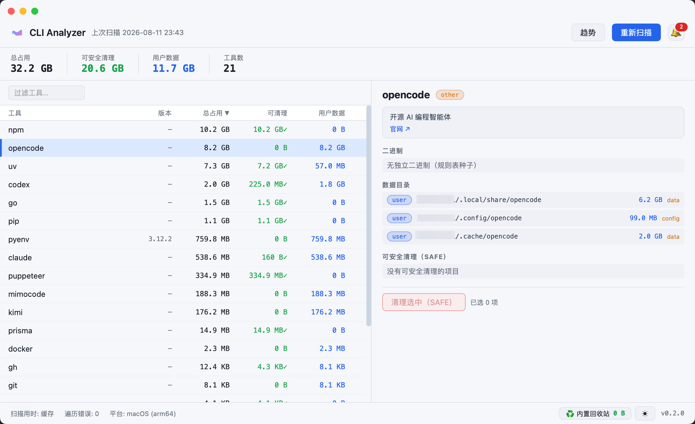
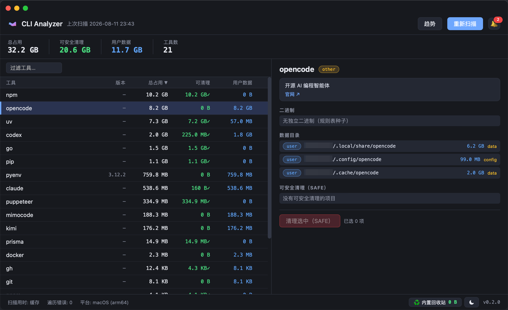

<h1 align="center">CLI Analyzer</h1>

<p align="center">
  找出哪些 CLI 工具在悄悄吃掉你的磁盘 —— 并<strong>安全地</strong>收回空间。
</p>

<p align="center">
  
  
  
  
</p>

<p align="center">
  <a href="README.md">English</a> · <b>简体中文</b>
</p>

---

清理软件（如 CleanMyMac）能看到**桌面端应用**的磁盘占用，却看不到 **CLI 工具**的占用——因为 CLI 数据散落在主目录的隐藏点目录和 XDG 数据目录里（`~/.claude`、`~/.npm`、`~/.cache/*`），被归类为"其他"或被忽略。

CLI Analyzer 扫描系统上安装的 CLI 工具，归因每个工具的总磁盘占用（可执行文件 + 包目录 + 数据/缓存目录），并识别**可安全清理**的空间。同一二进制既是 CLI 也是原生 GUI（Wails v2，暗色界面）。

| 浅色主题 | 深色主题 |
|---|---|
|  |  |

## 功能

- **检测**：枚举 `$PATH` 可执行文件，解析符号链接，按真实路径分类到安装源（versioned 安装器 / brew formula / npm 包 / pipx / pyenv shim / go / cargo / 其他）
- **归因**：每个工具的总占用 = 可执行文件 + 包目录（Cellar、node_modules、versions/…）+ 平台数据目录（`~/.cache/<名>`、`~/.config/<名>`、`~/.local/share/<名>`、macOS `~/Library/*`、Windows `%APPDATA%`…）
- **两级清理安全模型**
  - **SAFE**（缓存、旧版本、备份、包管理器缓存）—— 逐项确认后先移入内置回收站（可恢复）
  - **USER**（配置、历史、venv）—— 仅展示，**任何情况下都不会被自动删除**（硬门槛在 cleaner 层，`--yes` 也无法绕过）
- **内置回收站**：清理项先搬进应用自带的回收站（同文件系统，瞬时完成、可恢复），默认保留 7 天（可在"首选项"配置）；到期后默认移入系统回收站，或按配置彻底删除。GUI 底部常驻显示回收站占用与最早到期时间，让"已清理"与"已释放空间"区分开来
- **恢复**：可从 GUI 回收站面板或 `cli-analyzer trash restore` 还原项目；`clean --permanent` 可跳过内置回收站直接删除
- **占用趋势**：每次扫描自动追加历史快照；GUI 趋势视图（手写 SVG 折线）展示总占用/可清理随时间的变化与 cleanable 增量 Top 5，并在某工具可清理量超过阈值时以铃铛徽标提醒（点击可查看待清理工具并快速跳转，阈值可在"首选项"配置）
- **树形明细**：可清理项展开显示一级子目录占用（如 `~/.npm` → `_cacache` 10G / `_npx` 764M），可只勾选部分子项单独清理；子路径删除同样经过 SAFE 门槛与守卫（必须是扫描归因过的父项子路径）
- **内置更新**：启动时自动检查 GitHub Releases 是否有新版本（可在「首选项 → 更新」关闭，带 24h 限流缓存）；发现新版提示下载并展示进度条，下载后校验 SHA256 校验和，再打开安装包由你手动完成安装。CLI 侧：`cli-analyzer update check`。注意：新版本发布后 24h 内可能因缓存尚未刷新而不提示，稍候即会弹出
- **官方卸载**：不知道卸载命令？工具自动识别安装来源（brew / npm / pipx / cargo…），给出官方命令并可选代跑，随后检测残留的配置/缓存目录并移入内置回收站（可恢复）——这是唯一允许触碰用户数据的操作，绝不永久删除；系统关键工具拒绝卸载。CLI：`cli-analyzer uninstall <工具>`
- **多语言界面**：简体中文 / 繁體中文 / English 三种语言，默认跟随系统，可在「首选项 → 语言」切换（前端即时生效；macOS 原生菜单重启后生效）
- **双接口**：CLI（`scan` / `clean` / `cache` / `trash` / `trends` / `update` / `version`）+ 原生 GUI

## 安装

> **发布版**：macOS / Windows / Linux 安装包已发布在 [Releases 页面](https://github.com/kevinjoy89/cli-analyzer/releases)，也可从源码构建。
>
> **更新**：从包含该功能的版本起，应用启动时自动检查新版本（可在「首选项 → 更新」关闭），有新版时提示下载；下载到 `~/Downloads` 并与发布附带的 SHA256 校验和比对通过后，才会打开安装包——安装本身仍走系统原生流程。macOS 产物目前**未签名**，从网络下载的副本首次打开若被 Gatekeeper 拦截，请右键 → 打开。

依赖：**Go ≥ 1.26** 与 **npm**。

```bash
brew install go
export PATH="/opt/homebrew/opt/go/bin:$HOME/go/bin:$PATH"
go install github.com/wailsapp/wails/v2/cmd/wails@v2.13.0

# CLI 快速构建
go build -o bin/cli-analyzer .

# GUI 应用（同一二进制也可作 CLI）
wails build        # → build/bin/cli-analyzer
```

跨平台安装包（macOS dmg / Windows 安装器 / Linux deb-AppImage）的打包与签名见 **[docs/packaging.md](docs/packaging.md)**；macOS 一键出包用 `./scripts/build-dmg.sh`。

> **网络镜像说明**：本项目构建**不依赖任何特定 Go 镜像**，使用 Go 默认 proxy 即可，无需任何配置。仅**中国大陆网络**用户若拉取 Go 依赖超时，请在本机执行一次：
> `go env -w GOPROXY=https://goproxy.cn,direct`
> 该配置只写入你自己的环境（`~/.config/go/env`），不进入仓库、不影响其他开发者；切到其他网络环境时可用 `go env -u GOPROXY` 恢复默认。

## 用法

```bash
cli-analyzer scan                    # 扫描（首次较慢，之后读缓存秒开）
cli-analyzer scan --refresh --json   # 强制重扫并输出 JSON
cli-analyzer clean                   # 交互式逐项确认清理 SAFE 项（先入内置回收站）
cli-analyzer clean --dry-run --all   # 只显示清理计划，不删除
cli-analyzer clean --yes kimi        # 清理指定工具的全部 SAFE 项
cli-analyzer clean --permanent       # 立即彻底删除，跳过内置回收站
cli-analyzer trash list              # 列出内置回收站项目
cli-analyzer trash restore <id>      # 恢复一个项目到原路径
cli-analyzer trash empty             # 清空内置回收站（彻底删除）
cli-analyzer trends [天数]           # 查看最近 N 天占用趋势（默认 30 天）
cli-analyzer update check           # 检查新版本（退出码：0 已是最新 / 2 有更新 / 1 错误）
cli-analyzer uninstall <工具>       # 官方卸载 + 残留清理（走内置回收站）
cli-analyzer version                # 显示版本与安装来源（如 0.3.3 (darwin, dmg)）
cli-analyzer cache --clear           # 清除扫描缓存
cli-analyzer                         # 打开 GUI
```

真实扫描输出示例：

```
工具           命令  总占用       可清理(SAFE)  用户数据      来源
npm          -   10.2 GB   10.2 GB    0 B       npm
opencode     -   8.2 GB    0 B        8.2 GB    other
uv           -   7.3 GB    7.2 GB     57.0 MB   other
codex        -   2.0 GB    288.7 MB   1.8 GB    other
pip          -   1.1 GB    1.1 GB     0 B       pip
go           -   1.0 GB    753.7 MB   282.3 MB  go
pyenv        -   759.8 MB  0 B        759.8 MB  pyenv
...
合计           -   31.5 GB   19.9 GB    11.7 GB   -
```

**安全模型**：只有 SAFE 级（缓存/旧版本/备份/包管理器缓存）会被清理；USER 级（配置/历史/venv）仅展示。旧版本清理会自动保留当前版本（如 claude 的软链接目标）。

**延迟删除**：SAFE 项先搬进应用自带的内置回收站（同文件系统、瞬时完成、可恢复），在保留期（默认 7 天，可在"首选项"配置）内可随时还原；到期后默认移入系统回收站，或按配置彻底删除。GUI 状态栏会展示回收站占用与最早到期时间，`clean --permanent` 可跳过内置回收站。

### 清理安全边界（经过实测核验，以下一律不列入 SAFE）

| 目录 | 为何不可自动删除 |
|---|---|
| `~/.cache/opencode`、`~/.cache/mimocode` | 名为 cache，实为 opencode 系工具的**插件安装目录**（MCP 服务器、语言服务器、skills、`package.json` 清单）。删除会丢失全部插件且清单不可恢复 |
| pyenv / rustup 旧工具链（非当前版本） | pip 安装的命令会把解释器路径写死在 shebang 里（如 16 个命令引用 `~/.pyenv/versions/3.6.15/bin/python3.6`），项目也可能用 `rust-toolchain.toml` 锁定工具链。仅展示，手动用 `pyenv uninstall` / `rustup toolchain uninstall` 移除 |
| brew 非当前 Cellar 版本 | 可能被其他 formula 依赖（fontconfig 等），删除会破坏它们；`brew cleanup` 可安全处理 |
| `~/.cache/codex-runtimes/codex-primary-runtime` | codex 正在使用的运行时，删除会导致 codex 不可用；仅清理 `codex-runtime-install-*` 暂存目录 |

## 跨平台

- 扫描核心是纯 Go 标准库，`GOOS=linux/windows go build ./...` 可直接交叉编译
- **macOS**：额外扫描 `~/Library/{Caches, Application Support, Preferences}`
- **Linux**：XDG 目录；构建 GUI 需 `libwebkit2gtk-4.1`、`libgtk-3`
- **Windows**：`%APPDATA%`/`%LOCALAPPDATA%`；GUI 需在 Windows 宿主构建（WebView2）

## 已知限制（v1）

- 硬链接文件按路径重复计数（大小略偏高）；后续可用 inode 去重
- 扫描结果为快照；文件变更后需 `--refresh` 或 GUI 里点"重新扫描"

## 项目结构

```
main.go             # argv 分发：scan/clean/cache/trash/trends/version → CLI；否则 Wails GUI
gui/service.go      # Wails 绑定（唯一 import wails 的文件）
internal/scanner/   # 发现→分类→归因→可清理判定（纯核心）
internal/rules/     # 两级规则表 + 通用解析器
internal/platform/  # 各 OS 数据根目录与可执行检测（build tags）
internal/disk/      # 并行目录大小测量（无 du 依赖）
internal/cleaner/   # SAFE 硬门槛 + 守卫 + 延迟删除
internal/trash/     # 内置回收站：延迟删除/恢复/过期清除 + 各平台系统回收站
internal/config/    # 本地配置（保留期、过期动作、提醒阈值）
internal/history/   # SQLite 扫描快照，供占用趋势分析
internal/cli/       # scan / clean / cache / trash / trends 子命令
```

## 参与贡献

欢迎提交 [issue](https://github.com/kevinjoy89/cli-analyzer/issues) 反馈 bug 与想法，也欢迎提交 Pull Request。

## 许可证

[MIT](LICENSE) © 2026 kevinjoy89
